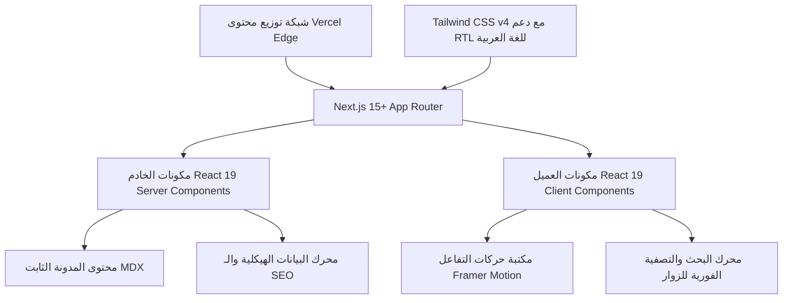

# وثيقة المرجع الشامل للمشروع (PROJECT_BIBLE.md)
## المصدر الوحيد للحقيقة للتصميم، البنية المعمارية، وتحسين محركات البحث لمشروع STREAMB4

---

## 1. الرؤية العامة والملخص التنفيذي

**STREAMB4** هو موقع ويب مميز ورفيع المستوى متكامل تماماً، يعتمد بالكامل على واجهة أمامية فقط (Frontend-only)، ويهدف لتسويق اشتراكات IPTV فائقة الجودة للمستهلكين المتحدثين باللغة العربية في منطقة الخليج العربي والشرق الأوسط.

تم إعداد هذا المستند ليكون المصدر النهائي والأوحد لجميع قرارات التصميم والتطوير البرمجي ومعمارية الأداء والـ SEO. يتيح هذا المستند لأي فريق من المطورين بناء وتطوير وصيانة هذا المشروع بكفاءة مطلقة ودون وجود أي غموض بنيوي.

### المبادئ المعمارية الأساسية:
1. **واجهة أمامية فقط (Frontend Only):** خالي تماماً من قواعد البيانات الخلفية، لوحات تحكم الإدارة (Admin Dashboards)، خوادم التحقق من الهوية، أو مسارات API المعقدة. يتم تصدير الموقع كاملاً كصفحات ثابتة (Static Export) ومؤرشفة مسبقاً للتشغيل الفوري على شبكة توزيع Vercel Edge.
2. **الخادم أولاً (Server Components by default):** نعتمد على بيئة عمل Next.js 15+ وهندسة React 19 لمكونات الخادم بشكل افتراضي. يتم تقليص مكونات العميل (Client Components) إلى أضيق الحدود (النماذج، حقول التصفية والبحث التفاعلية، القوائم المنسدلة، وحركات التفاعل الدقيقة).
3. **لغة المحتوى والسوق المستهدف:** يتم بناء المحتوى وهيكل الأسعار وملفات المخططات والـ SEO باللغة العربية بالكامل، مع التركيز على عملة الريال السعودي (SAR) والدولار الأمريكي (USD)، ودعم كامل لاتجاه النصوص من اليمين إلى اليسار (RTL).
4. **الأداء المثالي والأرشفة الكاملة:** نهيئ الموقع للحصول على درجة أداء تتراوح بين 95-100 على أداة Lighthouse، ودرجة كاملة 100 لتهيئة محركات البحث (SEO).

---

## 2. دراسة السوق والجمهور المستهدف

### التموضع في السوق (Market Positioning)
يعاني سوق الـ IPTV العربي من كثرة المواقع العشوائية والمخادعة ذات التصاميم الرديئة. يتميز مشروع **STREAMB4** بالدخول كبديل فاخر ورفيع المستوى وموثوق للغاية. تعتمد الواجهة على لغة بصرية متطورة تعكس الرقي والأمان (شبيهة بأسلوب Apple وStripe وLinear) لترسيخ شعور الأمان والموثوقية الفورية لدى الزائر العربي.

### الجمهور المستهدف
*   **الفئة الأساسية:** البالغون المتحدثون باللغة العربية (من 20 إلى 60 عاماً) الباحثون عن أفضل جودة بث للمباريات الرياضية الكبرى (الدوري السعودي للمحترفين، دوري أبطال أوروبا، الدوري الإنجليزي، الفورمولا 1) عبر قنوات الرياضة العالمية والعربية، والوصول لمكتبة ضخمة من الأفلام والمسلسلات العربية والأجنبية المترجمة والمبلجة (VOD).
*   **متطلبات العميل الرئيسية:** استقرار البث، جودة 4K/FHD خالية من التقطيع، دعم فني متجاوب بالعربية، خطوات تثبيت واضحة لكافة الأجهزة المنزلية، وتسهيلات دفع آمنة ومريحة.

### ركائز زيادة التحويل والثقة
*   **تأكيد الأمان والاستقرار:** التركيز على توفر خوادم محلية فائقة السرعة ومقاومة لضغط البث المباشر مع استقرار بنسبة 99.9%.
*   **خطط اشتراك مرنة:** عدم إلزام العميل بعقود طويلة الأجل، وإمكانية الإلغاء في أي وقت مع ضمان استرداد الأموال خلال فترة التجربة.
*   **دعم فني مخصص:** توفير أدلة إرشادية تفاعلية باللغة العربية لكافة الأجهزة الذكية مع قنوات تواصل مباشرة.

---

## 3. المعمارية التقنية وبيئة العمل



### التقنيات المعتمدة (Tech Stack)
*   **إطار العمل الرئيسي:** Next.js 15+ (App Router و React 19).
*   **تنسيق وتصميم الواجهات:** Tailwind CSS v4 مع توظيف التوجيهات المنطقية لدعم RTL (اليمين إلى اليسار).
*   **المكتبة الحركية:** Framer Motion (تستخدم فقط في مكونات العميل الفرعية المنفصلة).
*   **نظام المحتوى:** توليد المحتوى الثابت اعتماداً على ملفات MDX لصفحات المدونة وأدلة التثبيت.
*   **النوع البرمجي:** TypeScript بنمط تدقيق صارم (Strict Mode).

### الاستضافة ونشر المشروع
*   **منصة النشر:** Vercel.
*   **آلية التوليد:** التوليد الاستاتيكي الكامل للموقع (Static Site Generation - SSG) لجميع الصفحات والمقالات. يتم تحديث البيانات سريعة التغير (كأعداد القنوات أو التقييمات) عبر نظام إعادة التوليد الاستاتيكي الدوري (Incremental Static Regeneration - ISR) بمعدل مرة كل 24 ساعة (`export const revalidate = 86400`).
*   **تحسين الصور للتصدير الثابت:** لحل التعارض بين خاصية التصدير الثابت وتحسين الصور التلقائي، يعتمد المشروع على أداة تحسين الصور الخارجية (مثل Cloudinary) أو أداة الاستيراد المحسنة لتوليد صور مضغوطة بصيغة AVIF و WebP أثناء البناء.

---

## 4. هيكل المجلدات وتوزيع الملفات المعياري

توزيع ملفات منظم بشكل صارم يضمن فصل الاهتمامات وقابلية التوسع:

```text
streamb4-arabic/
├── .github/
│   └── workflows/
│       └── deploy.yml              # فحص البناء والنشر التلقائي على Vercel
├── .agents/
│   └── AGENTS.md                  # قواعد الذكاء الاصطناعي البرمجية الخاصة بالمشروع
├── app/
│   ├── (marketing)/                # مسارات التسويق والصفحات الأساسية
│   │   ├── about/
│   │   │   └── page.tsx            # صفحة من نحن ورؤيتنا
│   │   ├── channels/
│   │   │   └── page.tsx            # قائمة القنوات والبحث التفاعلي
│   │   ├── contact/
│   │   │   └── page.tsx            # صفحة اتصل بنا ونماذج الدعم الفني
│   │   ├── devices/
│   │   │   └── page.tsx            # الأجهزة والأنظمة المتوافقة
│   │   ├── faq/
│   │   │   └── page.tsx            # الأسئلة الشائعة المصنفة
│   │   ├── features/
│   │   │   └── page.tsx            # ميزات خوادم البث والتقنيات المستخدمة
│   │   ├── installation/
│   │   │   └── page.tsx            # أدلة وخطوات تشغيل الخدمة للأجهزة
│   │   ├── movies/
│   │   │   └── page.tsx            # استعراض مكتبة VOD (الأفلام والمسلسلات)
│   │   ├── pricing/
│   │   │   └── page.tsx            # خطط وأسعار الاشتراكات
│   │   ├── reviews/
│   │   │   └── page.tsx            # تقييمات المشتركين ومراجعاتهم
│   │   ├── sports/
│   │   │   └── page.tsx            # جدول ومواعيد المباريات الرياضية المباشرة
│   │   └── page.tsx                # الصفحة الرئيسية للموقع
│   ├── blog/                       # مسار المدونة والمقالات والتعليمات
│   │   ├── [category]/
│   │   │   ├── [slug]/
│   │   │   │   └── page.tsx        # عرض المقال الفردي (MDX)
│   │   │   └── page.tsx            # تصفح مقالات تصنيف معين
│   │   └── page.tsx                # أرشيف المدونة العام
│   ├── legal/                      # الصفحات القانونية والالتزامات
│   │   ├── privacy/
│   │   │   └── page.tsx            # سياسة الخصوصية وحماية بيانات الزائر
│   │   └── terms/
│   │   │   └── page.tsx            # شروط الاستخدام وقوانين الاشتراك
│   │   layout.tsx                  # تخطيط الصفحات القانونية (قراءة مريحة ومتمركزة)
│   ├── favicon.ico
│   ├── globals.css                 # ملف التنسيق العام لـ Tailwind CSS v4 مع تهيئة الخطوط والاتجاهات
│   ├── layout.tsx                  # التخطيط الرئيسي الشامل للموقع (يتضمن شريط التنقل والتذييل ووسم HTML الأساسي)
│   ├── not-found.tsx               # صفحة الخطأ 404 المخصصة بتصميم فاخر
│   ├── robots.ts                   # ملف إدارة محركات البحث والزواحف
│   └── sitemap.ts                  # خريطة الموقع الديناميكية لتسهيل الأرشفة
├── components/                     # المكونات البرمجية القابلة لإعادة الاستخدام
│   ├── ui/                         # مكونات الواجهة الأساسية (أزرار، حقول إدخال، بطاقات...)
│   │   ├── accordion.tsx
│   │   ├── alert.tsx
│   │   ├── badge.tsx
│   │   ├── button.tsx
│   │   ├── card.tsx
│   │   ├── input.tsx
│   │   ├── skeleton.tsx
│   │   └── table.tsx
│   ├── marketing/                  # الأقسام التسويقية المتكررة
│   │   ├── channels-grid.tsx
│   │   ├── device-selector.tsx
│   │   ├── faq-accordion.tsx
│   │   ├── hero-cta.tsx
│   │   ├── pricing-grid.tsx
│   │   ├── stats-strip.tsx
│   │   └── testimonial-slider.tsx
│   ├── blog/                       # المكونات الخاصة بالمدونة والمقالات
│   │   ├── author-box.tsx
│   │   ├── blog-card.tsx
│   │   ├── newsletter-box.tsx
│   │   ├── share-buttons.tsx
│   │   └── table-of-contents.tsx
│   └── layout/                     # مكونات الهيكل الخارجي للموقع
│       ├── footer.tsx
│       └── navbar.tsx
├── content/                        # مستودع مقالات المدونة (ملفات MDX) مصنفة حسب الأقسام
│   ├── categories.json             # تصنيفات المدونة وأسمائها
│   ├── sports/
│   │   └── live-matches-streaming.mdx
│   └── tutorials/
│       └── firestick-setup-guide.mdx
├── hooks/                          # الخطافات المخصصة للتحكم بالواجهات
│   ├── use-debounce.ts
│   └── use-scroll-position.ts
├── lib/                            # أدوات ومساعدين مساعدين للنظام
│   ├── mdx.ts                      # معالج ملفات المدونة واستخراج الخصائص الوصفية للمقالات
│   ├── schema.ts                   # أدوات توليد المخططات الهيكلية (JSON-LD Schemas) لمحركات البحث
│   └── utils.ts                    # أداة دمج فئات Tailwind البرمجية بأمان
├── public/
│   ├── fonts/                      # ملفات الخطوط العربية الفاخرة المدمجة محلياً (Cairo, Tajawal)
│   └── images/                     # الصور والوسائط المحسنة وأيقونات شبكات القنوات
├── next.config.mjs                 # إعدادات Next.js للمشروع
├── package.json
└── tsconfig.json                   # خيارات مترجم TypeScript الصارمة
```

---

## 5. نظام التصميم والأنماط البصرية (Tailwind CSS v4)

يتم تكوين نظام الألوان والخطوط والفراغات بشكل مركزي في ملف `app/globals.css` لضمان الاتساق التام وسرعة المعالجة.

### تعريف سمات التصميم الشاملة (`app/globals.css`):
```css
@import "tailwindcss";

@theme {
  /* لوحة الألوان الراقية - المظهر الداكن واللون الأخضر الزمردي الفاخر */
  --color-background: #070707;
  --color-surface: #101010;
  --color-surface-card: #181818;
  --color-surface-hover: #1e1e1e;
  
  --color-primary-50: #e6fcf4;
  --color-primary-100: #c2f9e4;
  --color-primary-500: #0BB783; /* اللون الأخضر الأساسي للعلامة */
  --color-primary-600: #00C896; /* الأخضر الزمردي المضيء للتفاعل */
  --color-primary-700: #16C784; /* الأخضر المساعد */
  --color-primary-900: #064e3b;
  
  --color-gray-100: #f4f4f5;
  --color-gray-300: #d4d4d8;
  --color-gray-400: #a1a1aa;
  --color-gray-500: #71717a;
  --color-gray-800: #27272a;
  --color-gray-900: #18181b;
  --color-border-subtle: #222222;

  /* الخطوط العربية المتوافقة مع الهوية الرقمية الحديثة */
  --font-display: "Cairo", sans-serif;
  --font-sans: "Tajawal", sans-serif;

  /* قيود زوايا العناصر الملتفة */
  --radius-xs: 4px;
  --radius-sm: 8px;
  --radius-md: 12px;
  --radius-lg: 16px;
  --radius-xl: 24px;
  --radius-full: 9999px;

  /* توهج الظلال الفاخر للعلامة الفاخرة */
  --shadow-emerald-glow: 0 0 20px -5px rgba(11, 183, 131, 0.15);
  --shadow-emerald-glow-hover: 0 0 30px -2px rgba(0, 200, 150, 0.25);
  --shadow-card-dark: 0 4px 30px 0 rgba(0, 0, 0, 0.9);
  --shadow-inner-glow: inset 0 1px 1px 0 rgba(255, 255, 255, 0.05);

  /* حركات التفاعل وتوقيت الانتقال */
  --transition-timing-premium: cubic-bezier(0.16, 1, 0.3, 1);
  --transition-duration-standard: 200ms;
  --transition-duration-slow: 400ms;
}

@layer base {
  html {
    scroll-behavior: smooth;
    font-family: var(--font-sans);
    background-color: var(--color-background);
    color: #ffffff;
    -webkit-font-smoothing: antialiased;
    -moz-osx-font-smoothing: grayscale;
  }

  body {
    background-color: var(--color-background);
    color: var(--color-gray-100);
    overflow-x: hidden;
  }

  h1, h2, h3, h4, h5, h6 {
    font-family: var(--font-display);
    font-weight: 700;
    letter-spacing: -0.01em;
    color: #ffffff;
  }
}
```

---

## 6. مواصفات المكونات البرمجية القابلة لإعادة الاستخدام

تلتزم جميع المكونات البرمجية بهيكل برمجي موحد مع تعريف صارم للأنواع بواسطة TypeScript.

### 6.1 مكون النصوص والخطوط (Typography)
*   **الغرض:** يوفر اتساقاً تاماً في تدرج أحجام النصوص والمسافات البينية للعناوين والفقرات.
*   **الأنواع البرمجية (Props):**
    ```typescript
    interface TypographyProps {
      as?: 'h1' | 'h2' | 'h3' | 'h4' | 'p' | 'span';
      variant?: 'hero' | 'title-lg' | 'title-md' | 'body-lead' | 'body' | 'caption';
      className?: string;
      children: React.ReactNode;
      id?: string;
    }
    ```
*   **مطابقة أنماط Tailwind:**
    *   `hero`: `font-display text-4xl sm:text-6xl md:text-7xl font-black tracking-tight leading-tight text-white`
    *   `title-lg`: `font-display text-3xl sm:text-4xl font-extrabold text-white`
    *   `title-md`: `font-display text-xl sm:text-2xl font-bold text-white`
    *   `body-lead`: `font-sans text-lg sm:text-xl text-gray-300 font-light leading-relaxed`
    *   `body`: `font-sans text-base text-gray-400 font-normal leading-relaxed`
    *   `caption`: `font-sans text-xs sm:text-sm text-gray-500 font-medium`
*   **إمكانية الوصول (Accessibility):** يتم استخدام الوسم البرمجي المناسب في المتصفح تلقائياً بناءً على الخاصية `as` لضمان قراءة هيكلية صحيحة من قبل قارئات الشاشة.
*   **الأداء:** يعمل كمكون خادم (RSC) لتقليل حجم حزم الكود المحملة لدى العميل.

### 6.2 مكون الأزرار التفاعلية (Button)
*   **الغرض:** تنفيذ عمليات النقر وتوجيه المستخدمين لروابط الشراء والدعم.
*   **الأنواع البرمجية (Props):**
    ```typescript
    interface ButtonProps {
      variant?: 'primary' | 'secondary' | 'ghost';
      size?: 'sm' | 'md' | 'lg';
      href?: string;
      onClick?: (e: React.MouseEvent<HTMLButtonElement>) => void;
      children: React.ReactNode;
      icon?: React.ReactNode;
      className?: string;
      disabled?: boolean;
      ariaLabel?: string;
    }
    ```
*   **الأنماط البصرية للتفاعل:**
    *   `primary`: الخلفية باللون المضيء `bg-primary-500` مع حركة التكبير الطفيف `active:scale-98 transition-all hover:bg-primary-600 hover:shadow-emerald-glow-hover duration-200 text-black font-bold shadow-emerald-glow rounded-md px-6 py-3 flex items-center justify-center gap-2`.
    *   `secondary`: حدود راقية مع تأثير التمرير `border border-gray-800 bg-surface text-white hover:bg-surface-hover hover:border-gray-500 rounded-md px-6 py-3 transition-colors`.
    *   `ghost`: تفاعل ناعم للغاية `text-gray-400 hover:text-white hover:bg-surface/50 rounded-md px-4 py-2 transition-all`.
*   **التصفح عبر لوحة المفاتيح:** يدعم إطار التركيز المرئي `focus-visible:ring-2 focus-visible:ring-primary-500 focus-visible:ring-offset-2 focus-visible:ring-offset-background` مع توفير تسمية واضحة لقارئات الشاشة عبر `aria-label`.

---

## 7. معمارية محرك تحسين محركات البحث (SEO) والبيانات المهيكلة

يتم تضمين البيانات المنظمة (JSON-LD) ومحرك الكلمات الدلالية مباشرة كجزء أساسي من التصميم البنيوي لكل صفحة من الصفحات.

### هيكل المخططات المنظمة ومولدات البيانات (Structured Data Schemas)
يتم بناء وتوليد مخططات مخصصة باللغة العربية لدعم الأرشفة الذكية من قبل محركات بحث Google في الدول العربية:
*   **مخطط المؤسسة (Organization Schema):** لتوضيح طبيعة وهوية الموقع لـ Google.
*   **مخطط المنتج والاشتراك (Product & AggregateOffer Schema):** لعرض تفاصيل الأسعار والتقييمات والعملة (SAR) مباشرة في نتائج البحث للعملاء الباحثين عن الاشتراك.
*   **مخطط الأسئلة والأجوبة (FAQ Schema):** لتسهيل أرشفة الأسئلة المتكررة وظهورها بشكل مباشر في صفحات النتائج.

---

## 8. بنية صفحات الموقع والتوليد الاستاتيكي

يتم استعراض وتصميم وهيكلة صفحات الموقع الـ 18 كصفحات ثابتة مع معايير جودة وأداء صارمة:

1.  **الصفحة الرئيسية (`/`):** الواجهة الترويجية المتكاملة الموجهة للتحويل وتأكيد مصداقية الخدمة.
2.  **صفحة الأسعار والاشتراكات (`/pricing`):** تعرض خطط الاشتراك وعقد المقارنات البصرية والأسعار بالريال السعودي والدولار.
3.  **صفحة القنوات التفاعلية (`/channels`):** فلترة وبحث فوري في القنوات والشبكات المتاحة للمشتركين لتعزيز الثقة.
4.  **صفحة تغطية الأحداث الرياضية (`/sports`):** جداول البث المباشر لأهم البطولات والدوريات المتاحة.
5.  **صفحة تثبيت وإعداد الخدمة (`/installation`):** أدلة تفاعلية خطوة بخطوة للأجهزة الشائعة مثل Firestick و Smart TVs.
6.  **أرشيف المدونة والمقالات التعليمية (`/blog`):** أحدث المقالات والتعليمات المكتوبة بلغة MDX محسنة للـ SEO.
7.  **الصفحات القانونية وسياسة الاستخدام والتواصل:** لضمان توافق الموقع مع الشفافية وبناء الثقة الكاملة.

---

## 9. إرشادات الأداء والجودة (Performance Auditing)

لضمان الحفاظ على أداء فائق في الدول العربية بمختلف سرعات الاتصال، يلتزم المطور بالمعايير التالية:
*   تحميل الأصول والخطوط محلياً من مجلد `public/fonts` وتفادي جلب الموارد الخارجية أثناء تحميل الصفحة.
*   تطبيق التحميل الكسول (Lazy Loading) للمقاطع والصفحات الطويلة التي تقع أسفل خط الطي.
*   توليد وتصدير ملفات التنسيق المضغوطة والأكواد البرمجية النظيفة الخالية من التكرار تماشياً مع معايير React 19 الجديدة.
